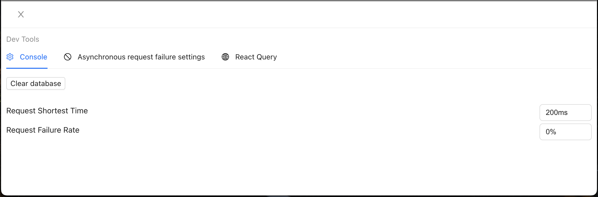

# React & TypeScript Mastery: Best Practices 2023
> Exclusive Developer Tool

Installation:

```shell
yarn add jigma-dev-tool
```

Set up an MSW service worker:

```shell
yarn msw init public
```
Usage:

```jsx
import { DevTools, loadServer } from "jigma-dev-tool";

loadServer(() =>
  ReactDOM.render(
    <React.StrictMode>
      <DevTools />
      <App />
    </React.StrictMode>,
    document.getElementById("root")
  )
);
```

## Introduction to Two Main Features
### 1. Simulate the behavior of an API server
Two main problems with traditional teaching project backend service:

- Fragile service, limited number of requests, unstable, and if it goes down, learners cannot use it
- Limited control over the backend database, such as the inability to easily reset the database

This developer tool simulate the behavior of an API server using MSW with Service Worker:



- All requests are proxied by Service Worker
- Backend logic processing is done through localStorage for CRUD operations

### 2. Precise Control of HTTP Requests
The robustness of the project is often overlooked in many teaching projects. As a best practice project, robustness is a key focus.
- This developer tool provides precise control over the timing, failure probability, and failure rules of HTTP requests.
